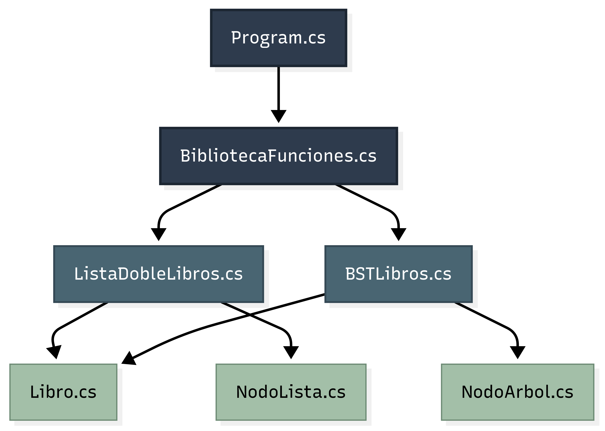

# 1. Proyecto: Gestión de Biblioteca Digital  

Este proyecto de documentará fase por fase, desde lo mas básico a lo avanzado, para mayor entendimiento y que cualquier persona pueda seguirlo sin tener ningun problema. 


**INDICE**
- [1. Proyecto: Gestión de Biblioteca Digital](#1-proyecto-gestión-de-biblioteca-digital)
	- [1.1. Instalación de Herramientas Necesarias](#11-instalación-de-herramientas-necesarias)
	- [1.2. Cómo ejecutar el proyecto](#12-cómo-ejecutar-el-proyecto)
- [2. Fases del Proyecto](#2-fases-del-proyecto)
	- [2.1. Fase 1](#21-fase-1)
		- [2.1.1. Estructura del Proyecto en la Fase 1](#211-estructura-del-proyecto-en-la-fase-1)
		- [2.1.2. Creación de la Estructura Básica](#212-creación-de-la-estructura-básica)
	- [2.2. Fase 2](#22-fase-2)
		- [2.2.1. Estructura del Proyecto en la Fase 2](#221-estructura-del-proyecto-en-la-fase-2)
		- [2.2.2. Métodos implementados](#222-métodos-implementados)
	- [2.3. Fase 3](#23-fase-3)
		- [2.3.1. Integración Lista Doble y BST](#231-integración-lista-doble-y-bst)
		- [2.3.2. Funciones avanzadas](#232-funciones-avanzadas)
		- [2.3.3. Funcionalidades disponibles desde el menú](#233-funcionalidades-disponibles-desde-el-menú)
- [3. Anexos](#3-anexos)
	- [3.1. Anexo 1: Configuración de llaves SSH en GitHub](#31-anexo-1-configuración-de-llaves-ssh-en-github)
	- [3.2. Anexo 2: Diagrama con Mermaid](#32-anexo-2-diagrama-con-mermaid)


## 1.1. Instalación de Herramientas Necesarias  

Antes de comenzar, asegúrate de tener instaladas estas herramientas:  

1. **Visual Studio Code** (editor de código)  
   - Descargar desde: [https://code.visualstudio.com/](https://code.visualstudio.com/Download)  

2. **.NET SDK (para C#)**  
   - Descargar desde: [https://dotnet.microsoft.com](https://dotnet.microsoft.com/download)
   
Una vez instalado, abre una terminal y escribe:  
   ```bash
   dotnet --version
   ```

Si aparece un número de versión, la instalación fue correcta.

3. **Git**
   - Descargar desde: [https://git-scm.com/downloads](https://git--scm-com.translate.goog/downloads?_x_tr_sl=en&_x_tr_tl=es&_x_tr_hl=es&_x_tr_pto=tc) 


Verifica la instalación con:

```bash
git --version
```

4. **GitHub** (repositorio en la nube)
   1. Crear una cuenta gratuita en: https://github.com

   2. Clonación del Repositorio en GitHub.
    - Copia la URL HTTPS o SSH del repositorio:
		- **SSH:** git@github.com:JennyKCP/Biblioteca_Digital.git  (Para este enlace debes de tener la llave .ssh en GitHub) **_Para mas información ir al anexo 1_**.
		- **HTTPS:** https://github.com/JennyKCP/Biblioteca_Digital.git (No requiere de ninguna llave).
  
- **DATO:** SSH usa claves criptográficas para una autenticación más segura, mientras que HTTPS usa un token de acceso o (anteriormente) usuario/contraseña.

5. **Prepara el Proyecto en tu PC** 
   
Abre Git Bash en la carpeta donde quieras guardar tu proyecto (Se recomienda el nombre de Biblioteca_Digital).

Clona el repositorio:

```bash
git clone HTTPS o SSH
```
Ingresa a la carpeta:

```bash
cd Biblioteca_Digital
```

Inicializa Git y conecta el proyecto con el repositorio:

```bash
git init
```
```bash
git remote add origin HTTPS o SSH
```

## 1.2. Cómo ejecutar el proyecto

1. Abrir **Git Bash** o terminal en la carpeta `BibliotecaDigital`.  
2. Ejecutar: 
    
```bash
dotnet run
```

Seleccionar la opción deseada del menú y seguir las instrucciones.


# 2. Fases del Proyecto

## 2.1. Fase 1

En esta fase determinara las clases base para la escalabilidad y mejor desarrollo del codigo.

- **Convención de Nombres:**
Este proyecto utiliza PascalCase para clases, métodos y propiedades.

- Ejemplo:

	- Clase -> ListaDobleLibros
	- Método -> AgregarLibro()
	- Propiedad -> Titulo

### 2.1.1. Estructura del Proyecto en la Fase 1

```bash
Biblioteca_Digital/
│
├── BibliotecaDigital/            # Proyecto en C#
│   ├── Program.cs                # Punto de entrada del programa
│   ├── Libro.cs                  # Clase Libro con atributos
│   ├── NodoLista.cs              # Clase Nodo de la lista doble
│   ├── ListaDobleLibros.cs       # Clase Lista Doble con operaciones
│   └── BibliotecaDigital.csproj  # Configuración del proyecto
│
└── README.md                     # Documentación del proyecto
```

### 2.1.2. Creación de la Estructura Básica

1. **Clase Libro**

Contiene los atributos:
```text
Titulo
Autor
Genero
Anio
Disponible
Ocupado
Prestado
```

Incluye el método `ToString()` para mostrar información en pantalla.

2. **Clase NodoLista**
   
Define los nodos de la lista doblemente enlazada.

Cada nodo contiene:
```text
Un objeto Libro.
Puntero al nodo anterior.
Puntero al nodo siguiente.
```

3. **Clase ListaDobleLibros**

Implementa la lista doble con los siguientes métodos:

```csharp
AgregarLibro() -> Inserta un libro al final.
EliminarLibro() -> Retira un libro por título.
RecorrerAdelante() -> Recorre desde el primero hasta el último.
RecorrerAtras() -> Recorre desde el último hasta el primero.
BuscarLibro() -> Busca un libro en la lista por título.
```

## 2.2. Fase 2

En esta fase se implementa un **árbol binario de búsqueda (BST)** para mejorar la **búsqueda y organización** de los libros. 

### 2.2.1. Estructura del Proyecto en la Fase 2

```bash
Biblioteca_digital/
│
├── BibliotecaDigital/            # Proyecto en C#
│   ├── Program.cs                # Punto de entrada del programa
│   ├── Libro.cs                  # Clase Libro con atributos
│   ├── NodoLista.cs              # Clase Nodo de la lista doble
│   ├── ListaDobleLibros.cs       # Clase Lista Doble con operaciones
│   ├── NodoArbol.cs              # Clase Nodo de el BST
│   ├── BSTLibros.cs              # Clase BST con operaciones
│   ├── BibliotecaFunciones.cs    # Integra la Lista Doble con el BST
│   └── BibliotecaDigital.csproj  # Configuración del proyecto
│
└── README.md                  # Documentación del proyecto
```
Se dejara un diagrama en Anexos para mayor entendimiento(Anexo 2).

### 2.2.2. Métodos implementados  

1. **BSTLibros** 
   
- **`InsertarLibroBST()`** -> Inserta libros en el árbol ordenados por título y, en caso de empate, por género.  
- **`BuscarLibroBST()`** -> Localiza un libro por título.  
- **`RecorrerEnOrden()`** -> Muestra los libros en orden alfabético.  
- **`RecorrerPreOrden()`** -> Recorre la raíz primero, luego subárbol izquierdo y derecho.  
- **`RecorrerPostOrden()`** -> Recorre subárboles antes de mostrar la raíz.  
- **`EliminarLibroBST()`** -> Elimina un libro manteniendo la propiedad del árbol.  


2. **Funciones avanzadas (con Lista Doble + BST)**  
   
- **`MostrarLibrosPorGenero()`** -> Muestra todos los libros de un género específico.  
- **`PrestarLibro()`** -> Cambia el estado de un libro a *Prestado*.  
- **`DevolverLibro()`** -> Cambia el estado de un libro de *Prestado* a *Disponible*.  
- **`ReporteLibros()`** -> Genera un reporte separado de libros *Disponibles* y *Prestados*.  


## 2.3. Fase 3

En esta fase se realizó la integración de todas las piezas del proyecto: la Lista Doble y el Árbol Binario de Búsqueda (BST). También se añadieron libros de prueba, un menú interactivo y funciones avanzadas.

### 2.3.1. Integración Lista Doble y BST

La Lista Doble (ListaDobleLibros) se utiliza para almacenar todos los libros en orden de inserción, permitiendo recorrer hacia adelante y hacia atrás, además de eliminar o buscar libros de manera directa.

El BST (BSTLibros) organiza los libros por título y género, permitiendo búsquedas y listados ordenados alfabéticamente.

- **Ambas estructuras trabajan en conjunto:**

	- Cuando se agrega un libro -> se inserta en la Lista Doble y también en el BST.
	- Cuando se elimina un libro -> se borra de ambas estructuras.
	- Cuando se presta o devuelve un libro -> el cambio de estado se refleja en ambas.

De esta forma, evitamos duplicaciones o inconsistencias en los datos.

### 2.3.2. Funciones avanzadas

- **PrestarLibro()**
Cambia el estado de un libro de Disponible -> Ocupado. Esto se hace tanto en la lista doble como en el BST, asegurando que el estado sea el mismo en cualquier recorrido.

- **DevolverLibro()**
Realiza la operación inversa, de Ocupado -> Disponible.

- **MostrarLibroGenero()**
Usa la lista doble para recorrer todos los libros y mostrar aquellos que pertenecen a un género específico (ejemplo: Terror, Ciencia Ficción).

### 2.3.3. Funcionalidades disponibles desde el menú

Se construyó un menú en consola con opciones numeradas que permiten probar todas las funciones.

Al iniciar el programa se cargan automáticamente 25 libros de prueba de distintos generos.

El usuario puede:

1. **Agregar libro** -> Permite agregar libros nuevos, se inserta en la **Lista Doble** y en el **BST**.  
2. **Buscar libro por título** -> Localiza un libro usando el **BST**.  
3. **Mostrar todos los libros en orden alfabetico** -> Recorre el BST en orden (`InOrder`).  
4. **Mostrar libros por género** -> Utiliza la **Lista Doble** para filtrar por género.  
5. **Prestar libro** -> Cambia el estado de `Disponible` a `Ocupado` y `Prestado`.  
6. **Devolver libro** -> Revertir el estado a `Disponible`.  
7. **Eliminar libro** -> Elimina el libro tanto de la lista doble como del BST.  
8. **Reporte de libros** -> Muestra libros disponibles y prestados.  
9. **Salir** -> Termina la ejecución del programa.  

Además, se agregó una función extra: limpieza de pantalla y pausa, de forma que el usuario debe presionar una tecla para continuar, haciendo la experiencia más clara y ordenada.

# 3. Anexos

## 3.1. Anexo 1: Configuración de llaves SSH en GitHub  

Configuración de una **llave SSH** para conectarte a GitHub de forma segura, sin necesidad de escribir tu usuario y contraseña cada vez que haces `git push` o `git pull`.  

1. **Verificar si ya existe una llave SSH**  

Abre **Git Bash** y ejecuta:  

```bash
ls -al ~/.ssh
```

Si ves archivos como:
```bash
id_rsa y id_rsa.pub
id_ed25519 y id_ed25519.pub
```
entonces ya tienes una llave creada. Si no aparecen, pasamos al siguiente paso.

2. **Crear una nueva llave SSH**

Ejecuta el siguiente comando en Git Bash:

```bash
ssh-keygen -t ed25519 -C "tu_correo_de_github@gmail.com"
```

- **Explicación:**
  - **-t ed25519** -> tipo de algoritmo (más seguro que RSA).
  - **-C "..."** -> tu correo vinculado a GitHub.

Cuando pida ruta para guardar la llave, presiona Enter (usa la predeterminada).

Cuando pida passphrase, puedes dejar vacío o escribir una contraseña para más seguridad.

3. **Iniciar el agente SSH**

Ejecuta en Git Bash:

```bash
eval "$(ssh-agent -s)"
```
```bash
ssh-add ~/.ssh/id_ed25519
```
4. **Copiar la llave pública**
Tu llave pública está en:

```bash
cat ~/.ssh/id_ed25519.pub
```

5. **Registrar la llave en GitHub**

- Ve a GitHub -> Settings -> SSH and GPG keys.
- Haz clic en New SSH key.
	- Ponle un título (ejemplo: Mi PC personal).
	- Pega la llave copiada y guarda.

6. **Probar conexión SSH**

En Git Bash, ejecuta:

```bash
ssh -T git@github.com
```
Si todo está correcto, verás un mensaje parecido a:

```vbnet
Hi tu-usuario! You're successfully authenticated, but GitHub does not provide shell access.
```

7. **Cambiar repositorio de HTTPS a SSH**
   
Si tu repo fue clonado con HTTPS, cámbialo a SSH:

```bash
git remote set-url origin git@github.com:tu-usuario/Biblioteca_digital.git
```
Verifica el cambio:

```bash
git remote -v
```
Debe mostrar algo como:

```scss
origin  git@github.com:tu-usuario/Biblioteca_digital.git (fetch)
origin  git@github.com:tu-usuario/Biblioteca_digital.git (push)
```

## 3.2. Anexo 2: Diagrama con Mermaid


